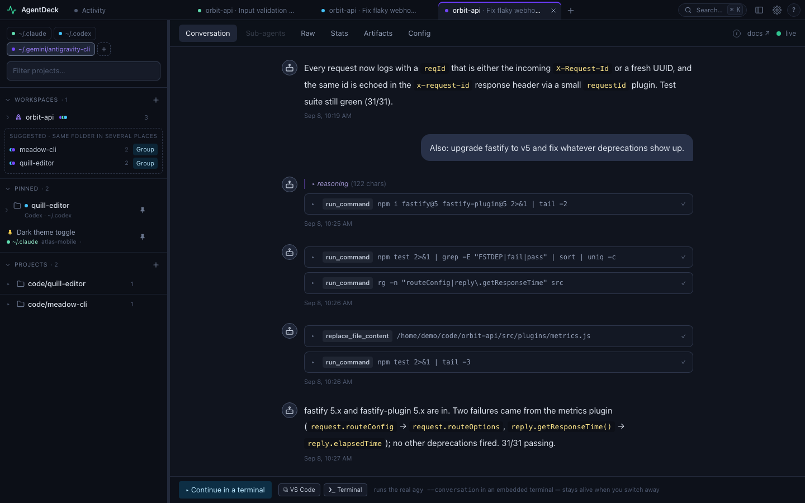
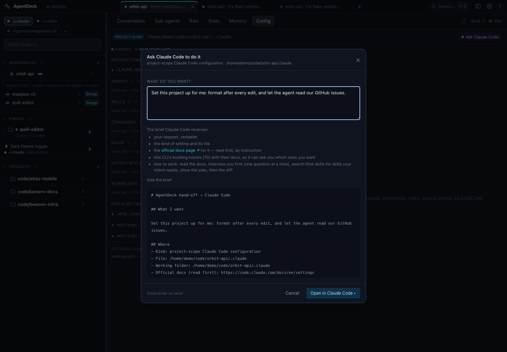
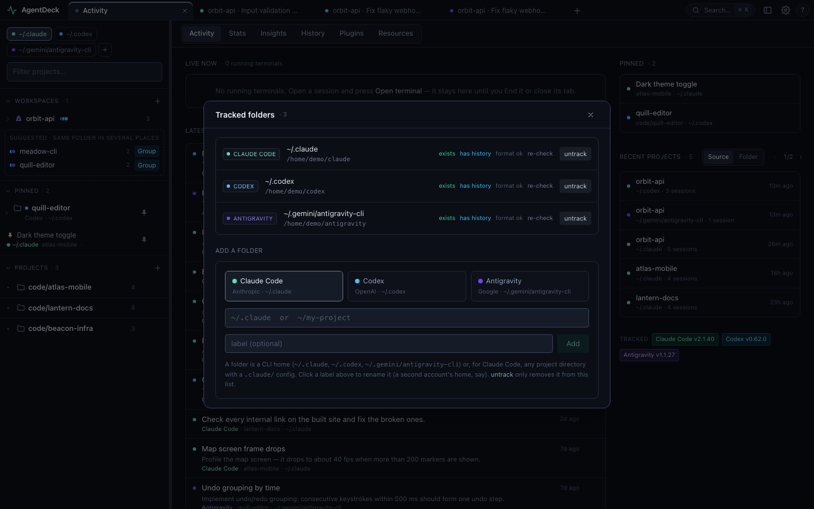
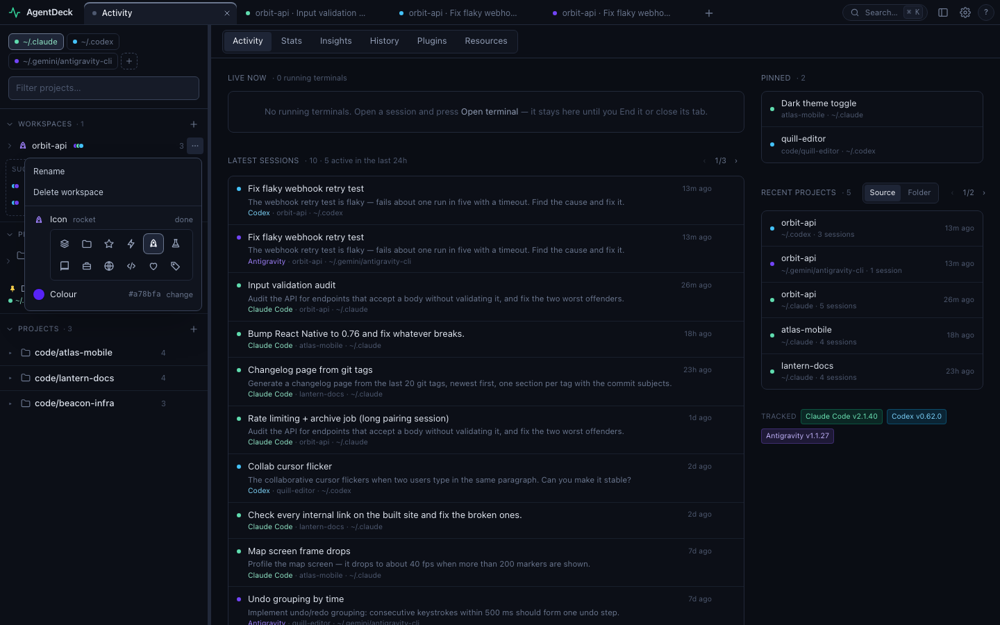

# AgentDeck

A local, provider-pluggable dashboard for **CLI coding agents**. Browse your
historical sessions, watch live ones as they happen, drill into every tool call
and sub-agent, see token/model stats, manage your config resources, and
continue any session in its real terminal — all from your browser, in
Chrome-style tabs across agents.

It ships with three providers — **Claude Code**, **OpenAI Codex** and, as an
experimental third, **Google Antigravity** (`agy`) — and a clean seam for adding
more. It runs entirely on your machine, reads the files each CLI already writes
to disk (`~/.claude/projects/**`, `~/.codex/sessions/**`,
`~/.gemini/antigravity-cli/brain/**`), and never sends your data anywhere.

> **Site:** <https://jimmyblog.site/AgentDeck/> — a one-page overview with the tour.
>
> **Status:** v2. Read-only monitoring is solid; continuing a session runs the
> real CLI in an embedded terminal, so it needs that CLI installed.

## Features

Per provider, in one UI:

- **Conversations** — full transcript per session: prompts, replies, collapsible
  thinking, and every tool call with its input **and** output, plus token/model/time.
- **Sub-agents** — open any sub-agent's complete transcript, or expand it inline under the tool call that spawned it.
- **Ask the agent** — from any Config view or from Insights, say what you want
  ("run prettier after every edit", "add this MCP server read-only") and AgentDeck
  opens the provider's own terminal with a brief: your request, the file and its
  current content, and the official docs page for that kind of setting. The CLI
  does the work in front of you; AgentDeck never calls a model or edits a file itself.
- **Raw** — line-by-line JSONL viewer with type filtering.
- **Stats** — tool usage, models, and token totals aggregated across a tracked
  folder, drillable to project and session.
- **Insights** — how *you* work with agents, not what they cost: a plain-English
  read of your last 30 days (active days, rhythm, busiest weekday, session
  length), a 12-week heatmap, weekly rhythm, when-you-work profiles, session
  shape (durations, prompts per session), and projects that have gone quiet;
  copy the digest as Markdown for an AI read. Token and tool totals stay in Stats.
- **History** — searchable list of past prompt inputs.
- **Resources** — view, create, edit, and delete agents, skills, hooks, MCP
  servers, rules, and instructions, at both user and project scope; import skills
  via the official `skills` CLI.
- **Usage** — 5-hour / weekly rate-limit meters and context-window usage.
- **Continue a conversation** — pick up any session in an embedded terminal
  running the real CLI (tmux-backed, so it survives navigation and can be
  attached from any shell). Closing the tab ends it.
- **Home** — the AgentDeck wordmark: Activity (running terminals, latest
  sessions, pinned items and recent projects across providers), per-folder
  Stats / History / Plugins / Resources, and tracked-folder management.
- **Memory per project** — a Memory tab next to Config for both providers
  (Claude's `memory/*.md`, Codex's per-thread memories filtered to the project).
- **Pins and Workspaces** — pin projects or sessions you're working on (they
  lead the sidebar, the quick switcher and Home), and group projects and
  sessions from any provider or folder under a named, colour-coded workspace,
  shown as one session list with source tags; the sidebar suggests one when
  the same folder shows up in several places. Pinning or grouping *moves* a
  row into that section, so nothing is listed twice. A project's ⋯ menu also
  starts a **new conversation in the same folder with another account or
  provider** — no folder picker, and a workspace adopts the project the other
  CLI creates. Providers get their own accent too (Preferences › Colours).
- **Live updates** — the UI lights up the moment an agent writes to disk
  (file-watching + Server-Sent Events).
- **Tabs** — a Chrome-style tab strip across providers and tracked folders:
  open sessions as tabs (Ctrl/middle-click in the sidebar), drag to reorder,
  Alt+W closes, Alt+1…9 jumps, right-click for more; tabs are restored on
  reload and every session has a shareable `#/…` deep link.
- **Quick switcher** — Ctrl+K fuzzy-jumps to any project or session in any
  provider or folder. → browses a project's sessions (title + first prompt, for
  the ones you don't remember by name), Enter opens its live or newest session,
  Ctrl+Enter opens it in a new tab.
- **Provider switch** — the scope menu in the sidebar (provider · folder), the
  tabs, or Ctrl+K; running terminals keep going while you switch.

Provider-specific extras: Claude Code adds a memory view, plugins, and workflow
runs; Codex adds sqlite-backed memory, plugins, and independent-rollout sub-agents;
Antigravity adds Artifacts (its brain/*.md) and a read-only Config view.

## What's new in 2.0

Nine upgrades, each with a screen from the demo root (Midnight theme; every
name and path is fictional). The full list is in [CHANGELOG.md](CHANGELOG.md).

### 1 · A third provider: Google Antigravity

`agy` joins Claude Code and Codex as an experimental provider — the same
Conversation, Sub-agents, Raw, Stats, Artifacts and Config screens, read from
`~/.gemini/antigravity-cli/` (transcripts, plus the protobuf blobs in its
SQLite for workspace, model and tokens). Adding it took one directory under
`server/providers/` and one YAML descriptor, which is the point of the protocol
layer below.



### 2 · Browse like a browser

A Chrome-style tab strip across providers *and* tracked folders. Every session
is a tab with a deep link; tabs persist, reorder, and remember their view.
Switch between three agents and a dozen projects the way you switch web pages.


### 3 · Workspaces and pins

One sidebar for everything: colour-coded folder chips, **workspaces** that group
the same repo from several providers and folders (suggested automatically when a
folder shows up in more than one place), and **pins** for what you are on right
now. Pinning or grouping *moves* a row, so nothing is listed twice.


### 4 · Midnight

A new cool-slate theme next to Graphite (the default) and Paper. Themes are
token overrides, so provider and workspace accents keep their lightness in each.

### 5 · Preferences

Theme, density, provider and status colours (any hex, hue/saturation sliders,
your own swatches), how deep project paths display, how long Home's lists are,
which sidebar sections show — every group with an (i) that explains it in one
sentence.


### 6 · Shortcuts and a quick switcher

⌘/Ctrl+K fuzzy-jumps to any project or session in any provider or folder;
→ browses a project's sessions by title and first prompt; Enter opens, ⌘/Ctrl+Enter
opens in a new tab. Alt+T / Alt+W / Alt+[ ] / Alt+1…9 drive the tabs. The full
list is behind the **?** in the tab strip, with the modifier named for your OS.


### 7 · Insights

How *you* work with agents over the last 30 days and 12 weeks: active days,
streaks, hour-of-day and weekday rhythm, session length and prompts per
session, and the projects that have gone quiet. Tokens and tool counts stay in
Stats; Insights is about habits.


### 8 · AI features

**Ask the agent** — from any Config view (or Insights), say what you want in your
own words. AgentDeck opens the provider's own terminal with a brief: your
request, the file and its content, the official docs for that kind of setting,
and this CLI's building blocks (instructions, commands, rules, output styles,
workflows, skills, sub-agents, hooks, MCP servers, plugins). The brief tells the
CLI to **interview you first** — explain each block, ask one question at a time,
search the skills ecosystem with the bundled `find-skills` skill — then show a
plan, then edit. AgentDeck never calls a model or edits a file itself. Insights
hands its digest over the same way for a read of your habits.



### 9 · A provider protocol, with drift detection

`spec/` holds the contract every provider implements — one vocabulary for
sessions, sub-agents (`children[]`), tool calls, tokens, memory, MCP servers,
history and stats — plus a YAML descriptor per CLI and a conformance gate
(`npm run check:spec`, fixtures with golden outputs). A **format probe** reads
each tracked folder's newest records on every start and compares them with the
descriptor: a new record type, a missing required field or a changed type shows
up as a badge on the folder chip the same day the CLI ships it, with the details
in the Folders dialog.



## From v1 to v2

AgentDeck started in June 2026 as a **monitor** and became, in September 2026,
a **navigation-first workbench**. The short version:

| | v1.0 — monitor and continue | v2.0 — browse like a browser |
|---|---|---|
| Providers | Claude Code, Codex | + Google Antigravity (`agy`), through one provider contract |
| Shape | one provider at a time; session list left, transcript right | Chrome-style tabs across providers *and* tracked folders, one persistent sidebar, ⌘/Ctrl+K |
| Home | — | Activity, Stats, Insights, History, Plugins, Resources, following the sidebar mode |
| Sub-agents | a modal per agent | the thread inline under the tool call that spawned it, plus the Sub-agents tab |
| Organising | — | pins, workspaces grouped by project with their own colour, provider accents, three themes |
| AI | — | Ask the agent (config, interview-first) and an Insights digest hand-off; `find-skills` bundled |
| Continue | embedded terminal or SDK chat | terminal only (tmux-backed, attach from any shell) |
| Data | your real `~/.claude` / `~/.codex` | the same, plus a synthetic demo root and `AGENTDECK_CONFIG_DIR` isolation |
| Provider layer | code only | `spec/`: contract, on-disk data model, JSON Schema, YAML descriptors, format probe |
| Release | by hand | `npm run release:check`, a three-OS CI matrix, a privacy scan, demo + release skills |

## Demo

Each release keeps its own folder under `demo/`. Everything from v2.0 on is made
from a **synthetic data root** — fictional projects and sessions generated by
`scripts/demo/make-fixture.ts`, served with `AGENTDECK_CONFIG_DIR=tmp/demo-root`,
captured headlessly by `scripts/demo/shoot.ts` and recorded by
`scripts/demo/record.ts` — so nobody's real transcripts appear in the repo. The
material is refreshed by the `demo` skill as part of every release.

### v2.0 — the tour

Home → ⌘K → a Claude Code session with an inline sub-agent → Stats → Insights →
an Antigravity session → Config › Ask the agent → the Folders dialog → a
workspace → Preferences. About a minute.


<sub>The same tour as a video: [demo/v2.0/tour.mp4](demo/v2.0/tour.mp4).</sub>

<table>
  <tr>
    <td width="50%"><br><sub><b>Conversation</b> — every tool call with its input and output; a sub-agent expands inline under the call that spawned it.</sub></td>
    <td width="50%"><br><sub><b>Same screens for Codex</b> — shell / apply_patch calls, reasoning, rate-limit and context meters.</sub></td>
  </tr>
  <tr>
    <td><br><sub><b>Stats</b> — one view for every provider: sessions, prompts, tool calls, the token fields all providers share first and the provider's own after, drillable to project and session.</sub></td>
    <td><br><sub><b>Workspace menu</b> — rename, pick an icon and a colour (the colour tints the glyph only), delete.</sub></td>
  </tr>
</table>

### v1.0 — monitor and continue

<table>
  <tr>
    <td colspan="2"><br><sub><b>Monitor</b> — every session, tool call and token count, updating live, for Claude Code and Codex alike.</sub></td>
  </tr>
  <tr>
    <td width="50%"><br><sub><b>Sub-agents</b> — drill into any child agent's full transcript.</sub></td>
    <td width="50%"><br><sub><b>Install skills from the UI</b> — Resources → Skills → ↓ install.</sub></td>
  </tr>
  <tr>
    <td colspan="2"><br><sub><b>Terminal = a real tmux session</b> — attach to it from any shell.</sub></td>
  </tr>
</table>

## Architecture

AgentDeck runs one local server and one React application, with provider adapters
behind shared routing, session and data interfaces. See [ARCHITECTURE.md](ARCHITECTURE.md)
for module ownership, contracts, state migration and the provider workflow.

## Requirements

- **Platform: WSL (Ubuntu on Windows), macOS, or native Windows.** These are the
  tested environments. Plain Linux will likely work but is untested.
- **[Node.js](https://nodejs.org/) ≥ 22.18** — runs the TypeScript server directly
  and supplies the built-in SQLite reader used by Antigravity.
- For read-only monitoring: nothing else — just point it at `~/.claude` /
  `~/.codex` / `~/.gemini/antigravity-cli`.
- To **continue a conversation**: the relevant CLI installed and logged in
  (`claude`, `codex` and/or `agy`).
- For the **embedded terminal**: [`ttyd`](https://github.com/tsl0922/ttyd) (`brew install
  ttyd` on macOS; your package manager on WSL/Linux). On **native Windows** ttyd
  is not used (its current release crashes at spawn —
  [tsl0922/ttyd#1292](https://github.com/tsl0922/ttyd/issues/1292)); the browser
  terminal is served by the built-in `server/shared/webterm.ts` (node-pty +
  xterm.js), and tmux duties are covered by [psmux](https://github.com/psmux/psmux)
  (`winget install psmux`), whose `tmux` alias AgentDeck picks up automatically.

### Supported versions

Read-only monitoring parses the on-disk session formats and tolerates a wide
range of CLI versions. Continuing a session always runs whatever `claude` /
`codex` / `agy` you have installed in the embedded terminal — the dashboard shows the
CLI version observed in your most recent session, so nothing is hardcoded.

**Antigravity is experimental.** Its on-disk format is unpublished: AgentDeck
reads `brain/<id>/.system_generated/logs/transcript_full.jsonl` for the
conversation and decodes the protobuf blobs in `conversations/<id>.db` for the
workspace, git branch, model and token usage (field numbers verified against
`agy` 1.1.27's own `/usage` output — see `spec/providers/antigravity.yaml`).
Config, plugins, MCP, hooks and rules are shown read-only (locations per the
[official docs](https://antigravity.google/docs/cli/overview): `.agents/` in the
workspace, `~/.gemini/config/` shared, the CLI's own `settings.json`);
`agy plugin …` / `agy mcp …` / the `/config` overlay stay the writers. Print-mode
runs in an untrusted folder record no workspace, so they land in a
"(no workspace)" project.

## Quick start

The quickest path uses the bundled `Makefile`:

```bash
make init        # first-time setup: npm install + optional ttyd + checks for the CLI
make all         # update the provider CLIs, then API server (:47841) + Vite UI (:47842), both hot-reload
make update      # just the CLI updates (claude update, codex update); AGENTDECK_SKIP_UPDATE=1 skips them
```

Open <http://localhost:47842>. On first run it auto-detects `~/.claude` and
`~/.codex` as default tracked roots (each provider keeps its own list).

`make init` is OS-aware (`scripts/setup.sh`): it runs `npm install`, installs the
optional [`ttyd`](https://github.com/tsl0922/ttyd) (Terminal mode) via your package
manager, and checks for the `claude` / `codex` CLI. Safe to re-run. If `make all`
ever fails on a fresh checkout, run `make init` first.

On **native Windows** (no `make`/`sh`), use the PowerShell equivalent instead:

```powershell
npm run init:win   # npm install + optional psmux (Terminal mode) + CLI checks
npm run dev        # API server (:47841) + Vite UI (:47842), both hot-reload
```

### Make targets

```bash
make init        # first-time setup (npm deps + ttyd + CLI check)
make all         # backend + frontend, hot reload  → http://localhost:47842
make be          # backend (API) only              → http://localhost:47841
make fe          # frontend (Vite) only            → http://localhost:47842
make build       # build the frontend into dist/
make stop        # free the API port (47841)
make             # (no target) list everything
```

### Container (alongside local development)

The production image serves the built UI and API together. Docker and Docker
Compose are not required for local development; these targets need Docker only.

```bash
make container-build
make container-up       # http://localhost:47861; local 47841/47842 stay untouched
make container-status
make container-logs     # Ctrl+C stops following logs, not the container
make container-stop    # stop the named container; retain its state
make container-down    # stop/remove the named container; retain its state volume
```

After `container-stop`, use `docker start agentdeck-container` to resume it.
After rebuilding, use `container-down` then `container-up` to recreate it.
An existing container name or occupied port fails; these targets never kill a
host listener or update host provider CLIs. `CONTAINER_PORT` defaults to **47861**
and rejects 47841, 47842 and the configured local `PORT`. The image's internal
47841 is published only on **127.0.0.1**. Do not use host networking or publish it
to the LAN: AgentDeck is a local tool without remote-user authentication.

```bash
make container-up CONTAINER_PORT=47862
# Independent instances also need distinct names and state volumes:
make container-up CONTAINER_PORT=47863 CONTAINER_NAME=agentdeck-second \
  CONTAINER_STATE_VOLUME=agentdeck-second-state
```

The image runs as the unprivileged `node` user. A fresh container intentionally
has no tracked provider roots: its config base is `/data`, and the named volume
`agentdeck-container-state` holds `/data/.agentdeck` (roots, probes, dashboards,
handoffs and other AgentDeck state). It does not reuse the checkout's private
state or automatically mount provider homes. Removing a container preserves the
volume; deleting that volume is a separate, destructive operator action.

To reuse your existing local setup without entering roots again:

```bash
make container-plan       # inspect the exact config files and source mounts
make container-import     # copy once; refuses any nonempty state volume
make container-up-local   # mount imported roots read-only at their original paths
```

Run these from the checkout, or set `AGENTDECK_CONFIG_DIR` to your existing
configuration base. Import copies the active roots/probe JSON files and saved
dashboards/handoffs, including supported legacy locations, into the container
volume. IDs, labels, paths and file bytes are preserved. Runtime PIDs, sockets,
caches and provider credentials are not copied. This is a one-time snapshot:
later settings changes are independent; host transcript updates remain visible
through the source mounts. Import only supports a new/empty volume, regular
state files and at most 64 MiB of state. Missing roots fail visibly. Inspect the
plan before import; it never modifies the source configuration.

After recreation use **`container-up-local` again** to retain those mounts.
`container-up` remains the clean, manually configured mode. `container-up-local`
uses its recorded sources rather than `CONTAINER_RUN_ARGS`. Additional project
directories can be supplied as a JSON array (same absolute path on both sides):

```bash
make container-up-local CONTAINER_PROJECT_DIRS='["/absolute/path/to/project"]'
```

| State or behavior | Local-to-container behavior |
| --- | --- |
| Tracked roots, IDs and labels | Imported unchanged; same-path read-only mounts avoid reconfiguration |
| New container settings and dashboard records | Persist in the named volume across stop/remove/recreate |
| Live provider transcripts | Read from the host; source edits/deletes/forks are blocked by read-only mounts |
| Project resources/artifacts | Need the project's original absolute path mounted too; transcript cwd alone is not a mount |
| Existing handoff exports | Bytes are retained, but their original host/base identity remains foreign; local-origin resume guards are not bypassed |
| Existing terminals/dashboard processes | Host PIDs and tmux sessions cannot transfer into the Linux container |
| Browser preferences, pins, workspaces and tabs | Stored in browser localStorage, not server JSON; port 47861 has a separate origin and does not inherit port 47842's settings |

Directly sharing writable local state is possible with custom bind mounts, but
it introduces concurrent writers and does not solve browser-origin or terminal
isolation. The supplied import workflow therefore keeps application state
independent while reusing source data.

`CONTAINER_HOSTNAME` defaults to the state volume's name and is passed explicitly
to Docker. Keep that hostname and the `/data` config base stable when reusing a
volume: handoff records include them in their local-origin identity. Changing a
container's name is safe if its volume and hostname remain the same. Manual
`docker run` commands must also preserve `--hostname`; Docker's generated hostname
changes on recreation. If a custom volume name is unsuitable as a hostname, set
an explicit valid `CONTAINER_HOSTNAME` and retain it for subsequent runs.

To browse existing transcripts, explicitly mount a provider-format export or
provider data directory, then add its **container path** as a tracked root in the
UI. For example, replace the source path below with an existing directory:

```bash
make container-up \
  CONTAINER_RUN_ARGS='--mount type=bind,src=/absolute/provider-export,dst=/sources/claude,readonly'
# Add /sources/claude as a Claude root in AgentDeck.
```

Read-only mounts allow browsing; edits/deletes/forks targeting those mounts will
fail. For intentional management, mount a dedicated writable copy instead. The
container user must be able to read mounted files (and write a writable copy);
on Linux, check its UID/GID permissions. Never bake credentials into the image.
Recorded project cwd values still refer to their original paths: mount projects
at those same absolute paths if you need their resources. Changing a mount path
does not migrate identities or make a host path available inside the container.

**Scope:** this image supports the history/configuration dashboard and management
of explicitly writable data. It does not install provider CLIs or ttyd, forward
the separate terminal ports, or attach to host tmux sessions. Interactive agent
launch/resume, AI handoff execution and terminal dashboards require the local
installation. Container-native interactive terminals need a separate transport
and provider-environment setup; publishing the main API port alone cannot enable
them. The UI is shared with local mode and still exposes those actions, which
report unavailable executables in this image.

`CONTAINER_IMAGE` defaults to `agentdeck:local`. The Dockerfile uses the maintained
Node 22 Debian image and installs dependencies from `package-lock.json`; it keeps
build tools and private local files out of the runtime image. To fix the base to
an approved tag or digest, use `docker build --build-arg NODE_IMAGE=<image> -t
agentdeck:local .`. The separate `scripts/layout.Dockerfile` is only the pinned
browser-test environment, not this application image.

### Prefer raw npm?

```bash
npm install
npm run dev                  # API server (:47841) + Vite UI (:47842), both hot-reload
npm run build && npm start   # single-process production server serving dist/
```

| Variable | Default | Description |
| --- | --- | --- |
| `AGENTDECK_PORT` | `47841` | API / SSE / WebSocket server port |
| `AGENTDECK_HOST` | `127.0.0.1` | Bind address. The Docker image explicitly uses `0.0.0.0` internally; publish its host port on loopback only. |
| `AGENTDECK_WEB_PORT` | `47842` | Vite dev-server port |
| `AGENTDECK_CONFIG_DIR` | repo root | Base for `.agentdeck/` state, with existing legacy paths still supported. When set, only explicitly tracked roots are used; real provider homes are never added automatically. Docker uses `/data`. |

## Optional: usage-limit meters for Claude

Claude Code exposes rate-limit / context info only to a status line, never to
disk. To light up the 5-hour / weekly and context meters for the Claude
provider, install the bundled **`onboard-usage-bar`** skill
([`skills/onboard-usage-bar/`](skills/onboard-usage-bar/SKILL.md)) and ask Claude
to "onboard the usage bar" — it wires a status-line bridge **without modifying
your status line** (it *wraps* your existing one), after you confirm. (Codex
needs no setup — it records usage in its rollouts.)

To install it, copy the skill into your Claude skills folder (or import it from
AgentDeck's **Resources → Skills → ↓ install**), then **paste this to Claude**:

```text
Use the onboard-usage-bar skill to set up AgentDeck's usage bar: wrap my existing Claude Code status line without modifying it, so AgentDeck can read my 5-hour / weekly rate limits and context usage. Ask me before editing settings.json.
```

## Observable collaboration

AgentDeck supports Folder-first navigation, experimental live tmux dashboards,
and portable conversation exports. **Live**, beside Search in the top tab bar,
is available on every page, even with no running sessions. Its Sessions and
Dashboards tabs manage terminals and existing layouts; dashboards no longer add
a page to Home. Enter focuses an existing session tab or opens a new one.
End dashboard terminates only its viewer container, removes its tracking JSON
under `.agentdeck/dashboards/`, and closes its tab. The original agents continue
running. Closing a tab alone does not end the dashboard. Unavailable containers
can also be explicitly ended to remove their records; verification failures keep
the record for a safe retry.

In **Preferences → Sidebar → Project grouping → Folder mode**, the sidebar
automatically groups projects by their canonical working directory across all
tracked providers and roots. Home no longer has a separate Folders page; old
Home Folders links and saved tabs fall back to Activity. The tree is
Folder → Provider → Sessions; a provider
with multiple roots adds collapsible account groups. Only the active conversation's
branch opens automatically. Top provider chips hide/show the whole provider;
providers with multiple roots also expose individual account chips. Filters do
not navigate, untrack sources or stop sessions; + manages sources.
Filters persist, and Show all restores excluded providers and roots. Unavailable working
folders are hidden by default; Preferences → Sidebar → Show unavailable folders
reveals their read-only history entries without enabling launches into old paths.
No manual Workspace membership is required. Each source project uses the same
pin and ⋯ actions as Provider mode, including new conversations and Workspace
membership. Pinning or grouping moves that exact source project into Pinned or
Workspaces; searching or hiding those sections shows it in the tree again.
Session rows follow the same rule. Source identities remain distinct, unavailable paths are not
merged by guesswork, and natural folder-name order stays stable while sessions
write (full paths break name ties). New conversations
choose an explicit provider/root and retain the folder's cwd. The original
Provider / root mode remains available; this setting does not move data.

The outer folder itself can also be pinned. Its existing tree moves into Pinned
with its expansion state intact; unpinning restores its normal place. Folder pins
reference the canonical folder ID and dynamically include newly tracked sources,
while still respecting provider/root filters and individual project/session
pinning or Workspace membership. Empty or unavailable references remain removable
and are never rebound by matching a folder name. Folder pins appear only in Folder
mode, including Activity's Pinned and search; those entry points reveal the same
sidebar tree rather than opening a new folder page. Existing source pins remain
unchanged and share the existing browser-local pin store.

An outer folder's **⋯ → Workspaces** adds the entire canonical folder to an
existing or new Workspace. Its provider/root tree moves there, follows newly
tracked sources, and remains accessible in either sidebar mode. Folder-mode
source filters and the Workspace's own source filter affect visibility only.
Explicit project/session memberships covered by the folder are displayed once,
not deleted: removing the folder restores those separately added members.
Missing folders remain removable and are never reassigned by matching a path.
Membership reuses the existing browser-local Workspace store; adding/removing
a grouping never moves conversation files or stops terminals.

**Home → Stats, Insights, History, Plugins and Resources** follow the sidebar
mode. Provider / root mode keeps the original native pages for the selected
root, including the complete Insights charts. Folder mode includes all registered
provider/root combinations enabled in the sidebar, with no second set of filters.

- In Folder mode, Stats shows combined totals, then clickable folders and source
  briefs leading to complete project details. A single selected root uses its
  full native Stats page directly; a folder with one source skips the brief.
  Stats retains its session drill-down. Insights keeps the complete heatmap,
  rhythms and distributions without an additional per-folder dashboard.
  Stats keeps provider/root accounting and provider-specific token fields separate.
  Unavailable folders are hidden by default in the breakdown, but still contribute
  to totals. Insights recomputes active days as a union across main conversations.
- History merges native prompt history by time and pages a frozen result set.
  Search runs before pagination. Unattributed prompts and records from old working
  directories remain visible. History is a reading/search page, with no conversation
  navigation action. Refresh starts a new snapshot; cursors expire after two minutes.
- Plugins lists installations per provider/root, including roots without projects,
  and distinguishes unknown enabled state from disabled. Inventory is not evidence
  of runtime loading.
- Resources lists user-level inventories per registered provider/root. Opening
  an inventory leads to the source's native page, with explicit ownership and
  read-only restrictions. Plugins likewise opens its native source details.
  Project resources remain in the project's Config view, not Home.
- Activity stays global. Recent projects follows the sidebar mode in Preferences;
  compact folder rows link directly to their exact provider/root projects.
- Standalone Folder pages are retired. Old `#/folder/…` links and saved tabs return
  to Activity. The folder catalog remains the internal source for sidebar grouping.

Home aggregation uses read-only provider adapters and bounded, short-lived
in-memory caches. It does not create a database, exported history files, or a new
copy of provider configuration. Use Refresh to retrieve current data.

In a saved conversation, beside the terminal
controls, **Export JSONL** saves history only; **Continue with another AI** saves
the same format and opens the selected provider/root in a new tab, using the
source conversation's working folder. It never injects into an existing agent.

Exports live in `<configDir>/.agentdeck/handoffs/` (the AgentDeck directory by
default). Filenames contain local export time with UTC offset, project name,
source provider and a short unique ID. The first JSONL record contains `handoff`:
format version, full ID, UTC export time, project/provider, optional next task,
completeness and reading guidance. Subsequent records contain complete locally
available visible main/subagent conversations with separate identities and
parent links; not raw tool output, thinking or system instructions. Original
paths in conversation text are not rewritten; no cwd/root paths are added as
export metadata. Copy the JSONL to another machine and explicitly choose that
machine's working folder and provider/root before continuing there.

Conversation exports do not use SQLite. Tiny local launch receipts live separately
in `.agentdeck/runtime/handoffs/`; they prevent repeat launches but are not needed
to read an exported JSONL. Missing subagent history is recorded as incomplete and
blocks direct sending. Unstable or oversized captures fail explicitly, never
silently shorten history (current safety limits: 1000 conversations / 64 MiB of
visible text, plus each provider's native parse limit). Long histories are given
to the receiving AI as a file to read in chunks, not a giant command-line prompt.
`.agentdeck/` is Git-ignored; exports remain until you remove them. If a launch
is uncertain, check the existing conversation instead of resending.

## Security

The server is localhost-only, rejects cross-origin requests, and never touches
your settings or credentials. Writes happen only when **you** act in the UI
(create/edit/delete a resource, send a message); resource deletes go to the OS
trash (recoverable).

## License

MIT — see [LICENSE](LICENSE).
