# AgentDeck

A local, provider-pluggable dashboard for **CLI coding agents**. Browse your
historical sessions, watch live ones as they happen, drill into every tool call
and sub-agent, see token/model stats, manage your config resources, and
continue any session in its real terminal — all from your browser, in
Chrome-style tabs across agents.

It ships with three providers — **Claude Code**, **OpenAI Codex** and, as an
experimental third, **Google Antigravity** (`agy`) — and a clean seam for adding
more. It runs entirely on your machine, reads the files each CLI already writes
to disk (`~/.claude/projects/**`, `~/.codex/sessions/**`,
`~/.gemini/antigravity-cli/brain/**`), and never sends your data anywhere.

> **Status:** v2. Read-only monitoring is solid; continuing a session runs the
> real CLI in an embedded terminal, so it needs that CLI installed.

## Features

Per provider, in one UI:

- **Conversations** — full transcript per session: prompts, replies, collapsible
  thinking, and every tool call with its input **and** output, plus token/model/time.
- **Sub-agents** — open any sub-agent's complete transcript, or expand it inline under the tool call that spawned it.
- **Raw** — line-by-line JSONL viewer with type filtering.
- **Stats** — tool usage, models, and token totals aggregated across a tracked
  folder, drillable to project and session.
- **Insights** — how *you* work with agents, not what they cost: a plain-English
  read of your last 30 days (active days, rhythm, busiest weekday, session
  length), a 12-week heatmap, weekly rhythm, when-you-work profiles, session
  shape (durations, prompts per session), and projects that have gone quiet;
  copy the digest as Markdown for an AI read. Token and tool totals stay in Stats.
- **History** — searchable list of past prompt inputs.
- **Resources** — view, create, edit, and delete agents, skills, hooks, MCP
  servers, rules, and instructions, at both user and project scope; import skills
  via the official `skills` CLI.
- **Usage** — 5-hour / weekly rate-limit meters and context-window usage.
- **Continue a conversation** — pick up any session in an embedded terminal
  running the real CLI (tmux-backed, so it survives navigation and can be
  attached from any shell). Closing the tab ends it.
- **Home** — the AgentDeck wordmark: Activity (running terminals, latest
  sessions, pinned items and recent projects across providers), per-folder
  Stats / History / Plugins / Resources, and tracked-folder management.
- **Memory per project** — a Memory tab next to Config for both providers
  (Claude's `memory/*.md`, Codex's per-thread memories filtered to the project).
- **Pins and Workspaces** — pin projects or sessions you're working on (they
  lead the sidebar, the quick switcher and Home), and group projects and
  sessions from any provider or folder under a named, colour-coded workspace,
  shown as one session list with source tags; the sidebar suggests one when
  the same folder shows up in several places. Pinning or grouping *moves* a
  row into that section, so nothing is listed twice. Providers get their own
  accent too (Preferences › Colours).
- **Live updates** — the UI lights up the moment an agent writes to disk
  (file-watching + Server-Sent Events).
- **Tabs** — a Chrome-style tab strip across providers and tracked folders:
  open sessions as tabs (Ctrl/middle-click in the sidebar), drag to reorder,
  Alt+W closes, Alt+1…9 jumps, right-click for more; tabs are restored on
  reload and every session has a shareable `#/…` deep link.
- **Quick switcher** — Ctrl+K fuzzy-jumps to any project or session in any
  provider or folder. → browses a project's sessions (title + first prompt, for
  the ones you don't remember by name), Enter opens its live or newest session,
  Ctrl+Enter opens it in a new tab.
- **Provider switch** — the scope menu in the sidebar (provider · folder), the
  tabs, or Ctrl+K; running terminals keep going while you switch.

Provider-specific extras: Claude Code adds a memory view, plugins, and workflow
runs; Codex adds sqlite-backed memory, plugins, and independent-rollout sub-agents.

## From v1 to v2

AgentDeck started in June 2026 as a **monitor** and became, in September 2026,
a **navigation-first workbench**. The short version:

| | v1.0 — monitor and continue | v2.0 — browse like a browser |
|---|---|---|
| Shape | one provider at a time; session list left, transcript right | Chrome-style tabs across providers *and* tracked folders, one persistent sidebar, Ctrl+K |
| Home | — | Activity, Stats, Insights, History, Plugins, Resources, per tracked folder |
| Sub-agents | a modal per agent | the modal, plus the thread inline under the tool call that spawned it |
| Organising | — | pins, workspaces grouped by project with their own colour, provider accents, three themes |
| Continue | embedded terminal or SDK chat | terminal only (tmux-backed, attach from any shell) |
| Data | your real `~/.claude` / `~/.codex` | the same, plus a synthetic demo root and `AGENTDECK_CONFIG_DIR` isolation |
| Provider layer | code only | `spec/`: contract, on-disk data model, JSON Schema, YAML descriptors |
| Release | by hand | `npm run release:check`, a three-OS CI matrix, a privacy scan, demo + release skills |

**What v2.0 adds** (the full list is in [CHANGELOG.md](CHANGELOG.md)):

- Tabs that persist, reorder and deep-link; Alt+W / Alt+1…9 / Alt+[ ] to drive them.
- Ctrl+K: fuzzy search over every project and session of every provider and folder.
- Home with Activity (live terminals, latest sessions, pins, recent projects) and Insights (how *you* work: rhythm, streaks, session shape, neglected projects).
- One shared sidebar: colour-coded folder chips as the only scope picker, workspaces, pinned rows, projects — pinning or grouping *moves* a row, so nothing is listed twice.
- Workspaces across providers and folders, listed per project, each with its own icon and colour; suggestions when the same folder shows up in several places (can be switched off).
- Inline sub-agent threads under the tool call that spawned them (Claude `Agent`/`Task`, Codex `spawn_agent`).
- Preferences: three themes, two densities, provider and workspace colours picked freely (hue and saturation sliders, the system colour dialog, a hex, your own saved swatches), sidebar sections on/off.
- A memory tab per project for both providers; the "+" folder dialog; the terminal as the only way to continue a session.
- The provider protocol layer in `spec/`, `make update` before `make all`, and the release gate.

## Demo

Each release keeps its own folder under `demo/`. Everything from v2.0 on is made
from a **synthetic data root** — fictional projects and sessions generated by
`scripts/demo/make-fixture.mjs`, served with `AGENTDECK_CONFIG_DIR=tmp/demo-root`,
captured headlessly by `scripts/demo/shoot.mjs` and recorded by
`scripts/demo/record.mjs` — so nobody's real transcripts appear in the repo. The
material is refreshed by the `demo` skill as part of every release.

### v2.0 — browse like a browser

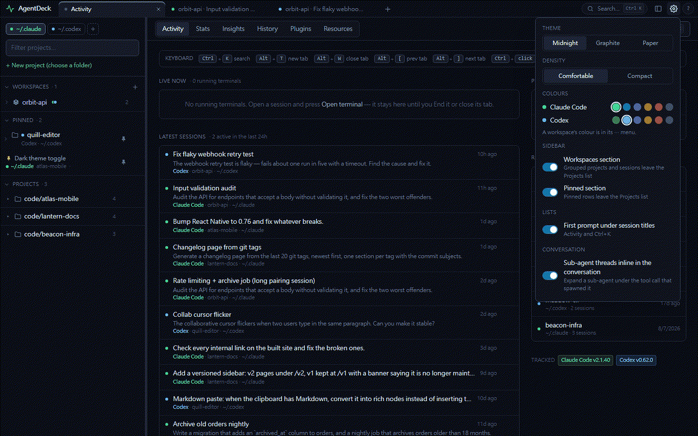

<sub>The same tour as a video: [demo/v2.0/tour.mp4](demo/v2.0/tour.mp4).</sub>

<table>
  <tr>
    <td width="50%">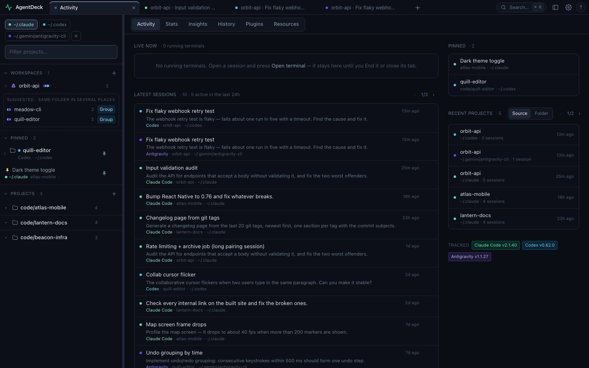<br><sub><b>Home · Activity</b> — running terminals, the latest sessions across every provider and folder, pinned items, recent projects and the keyboard map.</sub></td>
    <td width="50%">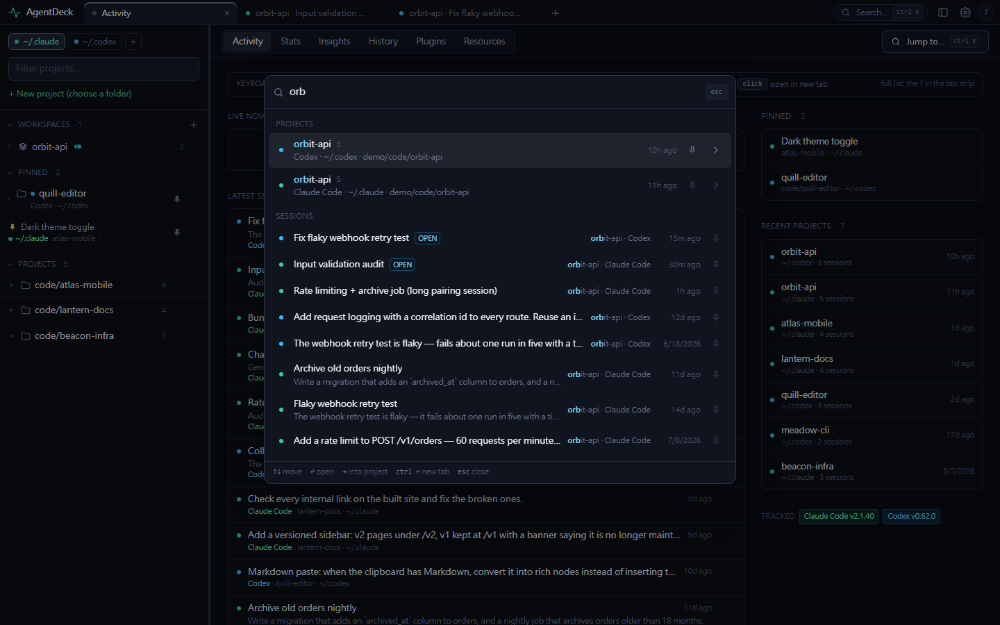<br><sub><b>Ctrl+K</b> — fuzzy-jump to any project or session in any provider; Enter opens it, Ctrl+Enter opens it in a new tab.</sub></td>
  </tr>
  <tr>
    <td>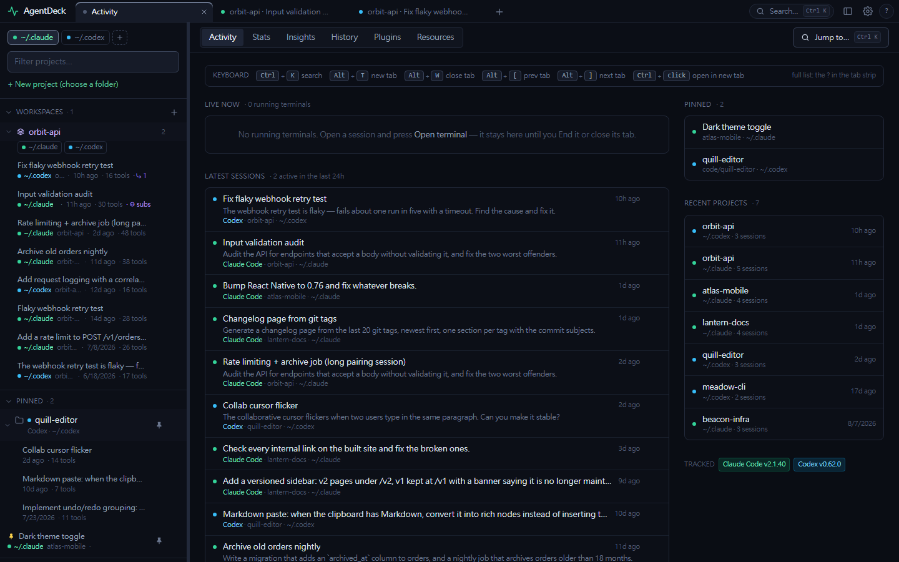<br><sub><b>One sidebar</b> — colour-coded folder chips, a workspace holding the same repo under Claude Code and Codex (listed per project), pinned projects and sessions.</sub></td>
    <td>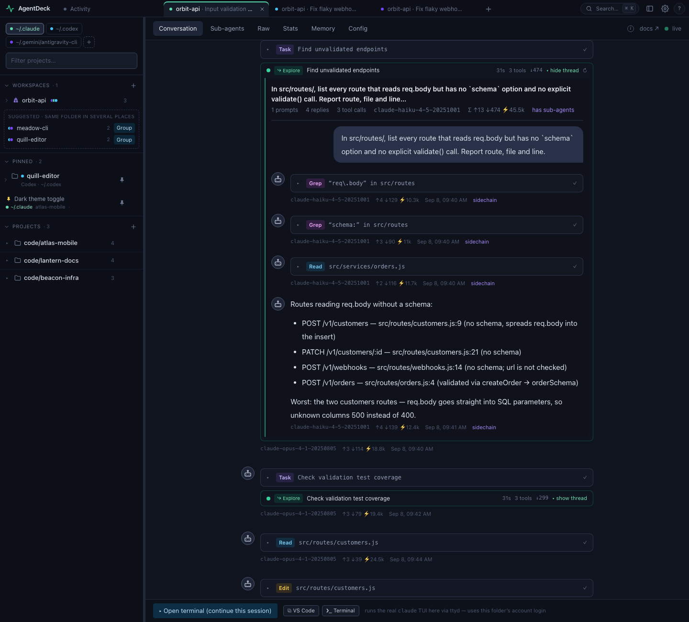<br><sub><b>Conversation</b> — every tool call with its input and output; a sub-agent expands inline under the call that spawned it.</sub></td>
  </tr>
  <tr>
    <td>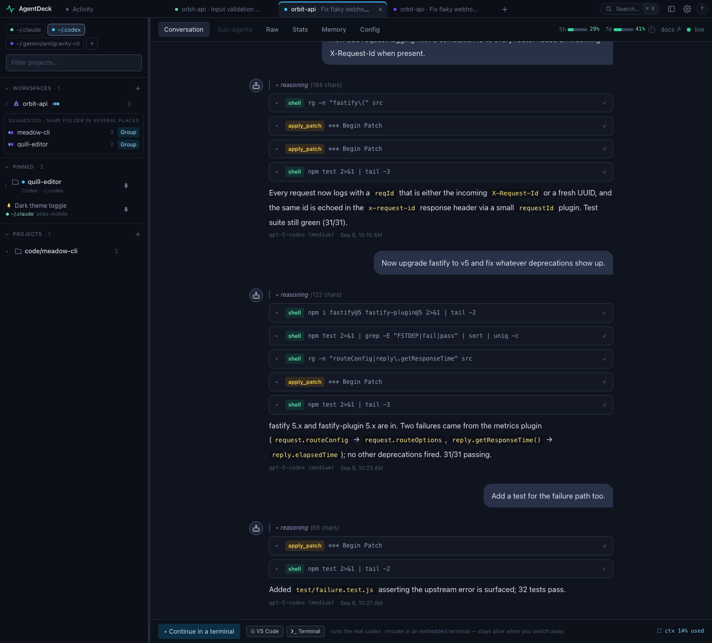<br><sub><b>Same screens for Codex</b> — shell / apply_patch calls, reasoning, rate-limit and context meters.</sub></td>
    <td>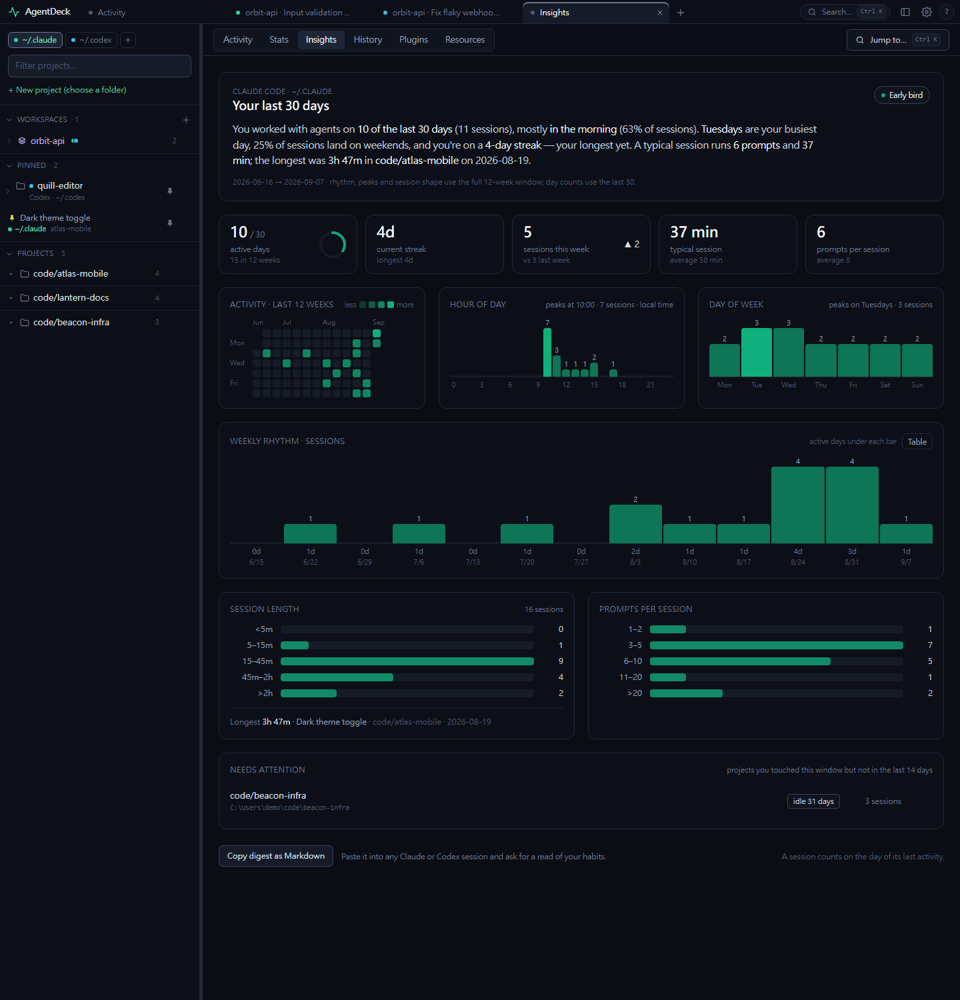<br><sub><b>Insights</b> — your own rhythm: hour of day, weekday, streaks, session shape, neglected projects.</sub></td>
  </tr>
  <tr>
    <td>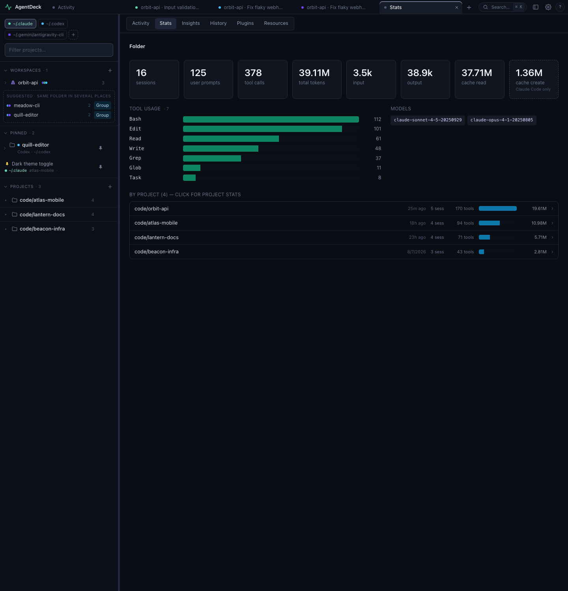<br><sub><b>Stats</b> — tokens, tools and models per tracked folder, drillable to project and session.</sub></td>
    <td>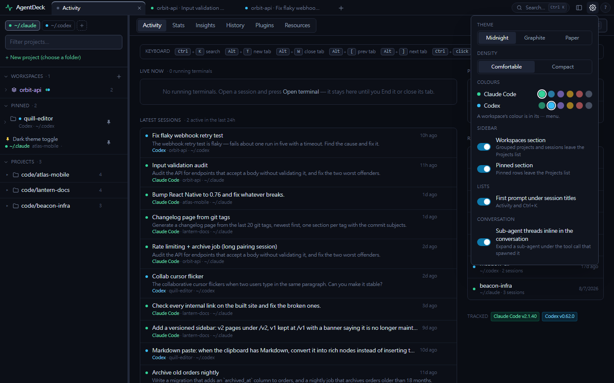<br><sub><b>Preferences</b> — theme, density, provider colours, which sidebar sections show.</sub></td>
  </tr>
</table>

### v1.0 — monitor and continue

<table>
  <tr>
    <td colspan="2"><br><sub><b>Monitor</b> — every session, tool call and token count, updating live, for Claude Code and Codex alike.</sub></td>
  </tr>
  <tr>
    <td width="50%">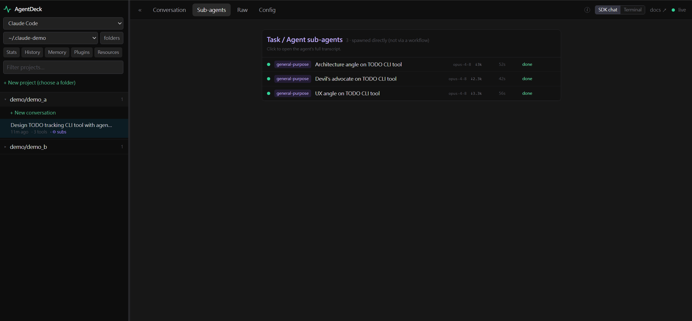<br><sub><b>Sub-agents</b> — drill into any child agent's full transcript.</sub></td>
    <td width="50%">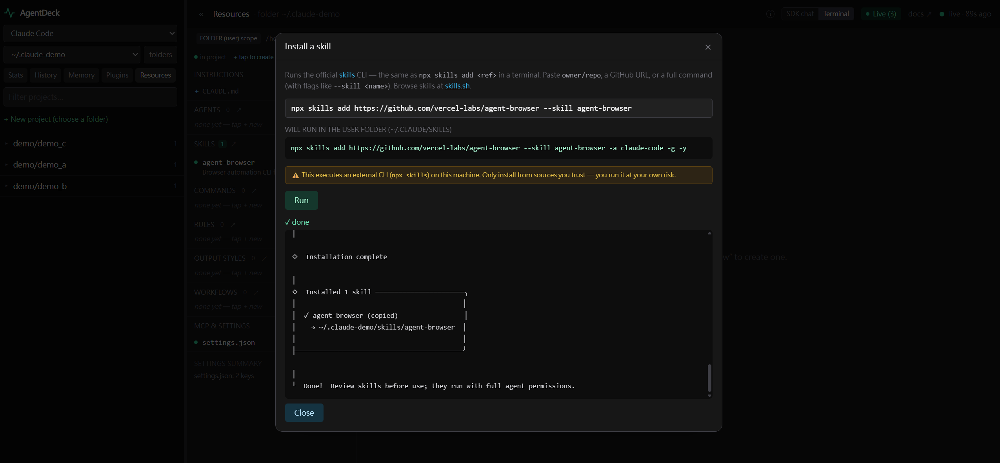<br><sub><b>Install skills from the UI</b> — Resources → Skills → ↓ install.</sub></td>
  </tr>
  <tr>
    <td colspan="2"><br><sub><b>Terminal = a real tmux session</b> — attach to it from any shell.</sub></td>
  </tr>
</table>

## Architecture

A **provider registry** keeps everything provider-specific behind one seam and
everything else shared.

```
server/
  index.js            HTTP/SSE host; routes /api/<provider>/…
  registry.js         the provider registry { claude, codex, antigravity }
  shared/             cross-provider code: roots, dispatch, terminal pool, skills, origin, launch
  providers/<id>/     a provider's data layer: paths, parser, resources, + config
src/
  App.jsx             shell: tab strip + quick switcher; the active tab picks the provider app (apps stay mounted)
  api.js              provider-aware client
  providers/<id>.jsx  a provider's frontend config: docs, tabs, components, capabilities
  components/shared/  shared, parameterized components
  components/<id>/    a provider's specific components
```

- **Backend** — one server routes `/api/<provider>/…` to the provider selected
  from `registry.js`. Cross-cutting code (tracked-roots
  management, dispatch, the terminal pool (ttyd; a built-in node-pty web
  terminal on native Windows), the skills runner, the origin
  guard, app launching) lives in `server/shared/`; only data-layout-specific code
  (paths, parsing, resources) lives per provider.
- **Frontend** — a thin shell renders both provider apps and switches by toggling
  visibility, so each app's terminals and live streams survive a tab switch.
  Tabs (`src/lib/tabs.js`) hold a `{ provider, root, slug, id }` target; the
  shell steers an app to a target via `pendingOpen`, and apps report user
  navigation back via `onNavigate` so the active tab follows.
  Shared components are parameterized; provider differences come from a config
  object plus a handful of provider-specific components.
- Tracked roots are stored per provider (`roots.<id>.json`); the server binds
  `127.0.0.1` only and rejects cross-origin browser requests.

See [spec/DATA-MODEL.md](spec/DATA-MODEL.md) for each provider's on-disk layout, and
[CONTRIBUTING.md](CONTRIBUTING.md) to **add a new provider** (no shared-core
changes needed).

## Requirements

- **Platform: WSL (Ubuntu on Windows), macOS, or native Windows.** These are the
  tested environments. Plain Linux will likely work but is untested.
- **[Node.js](https://nodejs.org/) ≥ 22.5** — the Antigravity provider reads
  its per-conversation SQLite through the built-in `node:sqlite` (workspace,
  model, tokens); on an older Node everything else still works and Antigravity
  degrades to what its JSONL transcripts carry.
- For read-only monitoring: nothing else — just point it at `~/.claude` /
  `~/.codex` / `~/.gemini/antigravity-cli`.
- To **continue a conversation**: the relevant CLI installed and logged in
  (`claude`, `codex` and/or `agy`).
- For the **embedded terminal**: [`ttyd`](https://github.com/tsl0922/ttyd) (`brew install
  ttyd` on macOS; your package manager on WSL/Linux). On **native Windows** ttyd
  is not used (its current release crashes at spawn —
  [tsl0922/ttyd#1292](https://github.com/tsl0922/ttyd/issues/1292)); the browser
  terminal is served by the built-in `server/shared/webterm.js` (node-pty +
  xterm.js), and tmux duties are covered by [psmux](https://github.com/psmux/psmux)
  (`winget install psmux`), whose `tmux` alias AgentDeck picks up automatically.

### Supported versions

Read-only monitoring parses the on-disk session formats and tolerates a wide
range of CLI versions. Continuing a session always runs whatever `claude` /
`codex` / `agy` you have installed in the embedded terminal — the dashboard shows the
CLI version observed in your most recent session, so nothing is hardcoded.

**Antigravity is experimental.** Its on-disk format is unpublished: AgentDeck
reads `brain/<id>/.system_generated/logs/transcript_full.jsonl` for the
conversation and decodes the protobuf blobs in `conversations/<id>.db` for the
workspace, git branch, model and token usage (field numbers verified against
`agy` 1.1.27's own `/usage` output — see `spec/providers/antigravity.yaml`).
Config, plugins, MCP, hooks and rules are shown read-only (locations per the
[official docs](https://antigravity.google/docs/cli/overview): `.agents/` in the
workspace, `~/.gemini/config/` shared, the CLI's own `settings.json`);
`agy plugin …` / `agy mcp …` / the `/config` overlay stay the writers. Print-mode
runs in an untrusted folder record no workspace, so they land in a
"(no workspace)" project.

## Quick start

The quickest path uses the bundled `Makefile`:

```bash
make init        # first-time setup: npm install + optional ttyd + checks for the CLI
make all         # update the provider CLIs, then API server (:47841) + Vite UI (:47842), both hot-reload
make update      # just the CLI updates (claude update, codex update); AGENTDECK_SKIP_UPDATE=1 skips them
```

Open <http://localhost:47842>. On first run it auto-detects `~/.claude` and
`~/.codex` as default tracked roots (each provider keeps its own list).

`make init` is OS-aware (`scripts/setup.sh`): it runs `npm install`, installs the
optional [`ttyd`](https://github.com/tsl0922/ttyd) (Terminal mode) via your package
manager, and checks for the `claude` / `codex` CLI. Safe to re-run. If `make all`
ever fails on a fresh checkout, run `make init` first.

On **native Windows** (no `make`/`sh`), use the PowerShell equivalent instead:

```powershell
npm run init:win   # npm install + optional psmux (Terminal mode) + CLI checks
npm run dev        # API server (:47841) + Vite UI (:47842), both hot-reload
```

### Make targets

```bash
make init        # first-time setup (npm deps + ttyd + CLI check)
make all         # backend + frontend, hot reload  → http://localhost:47842
make be          # backend (API) only              → http://localhost:47841
make fe          # frontend (Vite) only            → http://localhost:47842
make build       # build the frontend into dist/
make stop        # free the API port (47841)
make             # (no target) list everything
```

### Prefer raw npm?

```bash
npm install
npm run dev                  # API server (:47841) + Vite UI (:47842), both hot-reload
npm run build && npm start   # single-process production server serving dist/
```

| Variable | Default | Description |
| --- | --- | --- |
| `AGENTDECK_PORT` | `47841` | API / SSE / WebSocket server port |
| `AGENTDECK_WEB_PORT` | `47842` | Vite dev-server port |
| `AGENTDECK_CONFIG_DIR` | repo root | Directory holding the `roots.<provider>.json` files. When set, only the folders listed there are tracked — the real `~/.claude` / `~/.codex` are never added. Used by the demo fixture. |

## Optional: usage-limit meters for Claude

Claude Code exposes rate-limit / context info only to a status line, never to
disk. To light up the 5-hour / weekly and context meters for the Claude
provider, install the bundled **`onboard-usage-bar`** skill
([`skills/onboard-usage-bar/`](skills/onboard-usage-bar/SKILL.md)) and ask Claude
to "onboard the usage bar" — it wires a status-line bridge **without modifying
your status line** (it *wraps* your existing one), after you confirm. (Codex
needs no setup — it records usage in its rollouts.)

To install it, copy the skill into your Claude skills folder (or import it from
AgentDeck's **Resources → Skills → ↓ install**), then **paste this to Claude**:

```text
Use the onboard-usage-bar skill to set up AgentDeck's usage bar: wrap my existing Claude Code status line without modifying it, so AgentDeck can read my 5-hour / weekly rate limits and context usage. Ask me before editing settings.json.
```

## Security

The server is localhost-only, rejects cross-origin requests, and never touches
your settings or credentials. Writes happen only when **you** act in the UI
(create/edit/delete a resource, send a message); resource deletes go to the OS
trash (recoverable).

## License

MIT — see [LICENSE](LICENSE).
