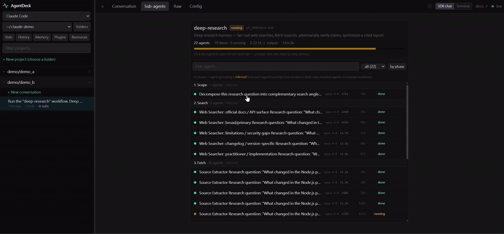
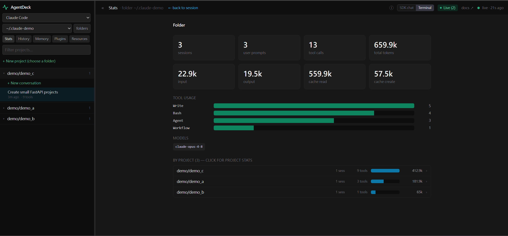
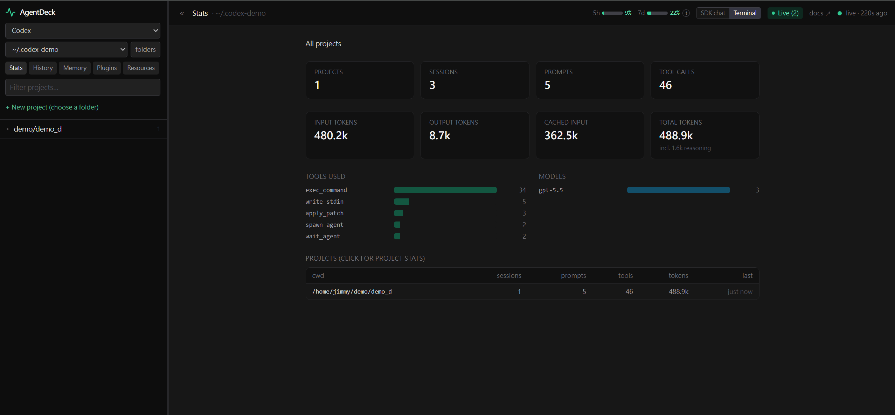
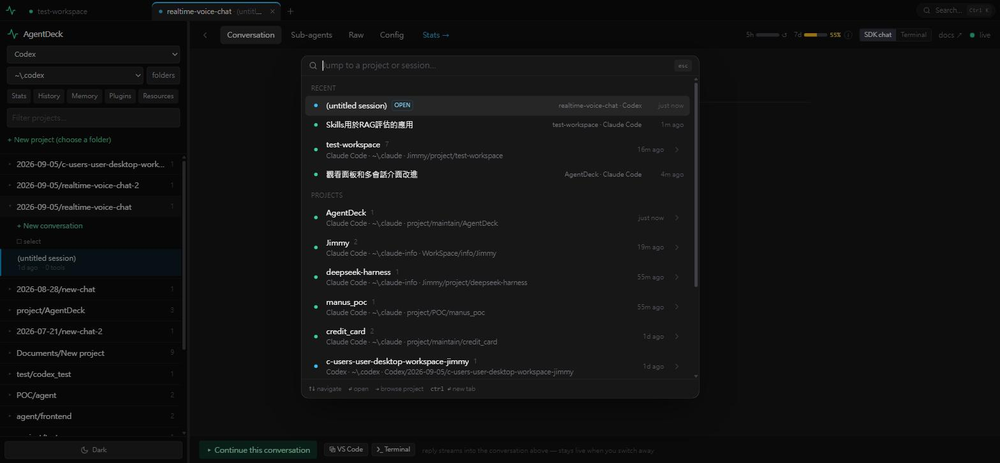
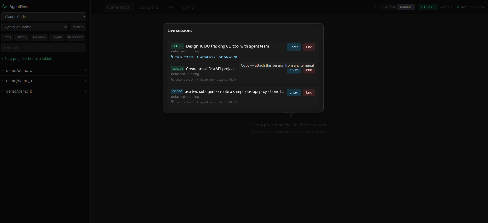

# AgentDeck

A local, provider-pluggable dashboard for **CLI coding agents**. Browse your
historical sessions, watch live ones as they happen, drill into every tool call
and sub-agent, see token/model stats, manage your config resources, and
continue any session in its real terminal — all from your browser, in
Chrome-style tabs across agents.

It ships with two providers — **Claude Code** and **OpenAI Codex** — and a clean
seam for adding more. It runs entirely on your machine, reads the files each CLI
already writes to disk (`~/.claude/projects/**`, `~/.codex/sessions/**`), and
never sends your data anywhere.

> **Status:** v2. Read-only monitoring is solid; continuing a session runs the
> real CLI in an embedded terminal, so it needs that CLI installed.

## Features

Per provider, in one UI:

- **Conversations** — full transcript per session: prompts, replies, collapsible
  thinking, and every tool call with its input **and** output, plus token/model/time.
- **Sub-agents** — open any sub-agent's complete transcript.
- **Raw** — line-by-line JSONL viewer with type filtering.
- **Stats** — tool usage, models, and token totals aggregated across a tracked
  folder, drillable to project and session.
- **Insights** — how *you* work with agents, not what they cost: a plain-English
  read of your last 30 days (active days, rhythm, busiest weekday, session
  length), a 12-week heatmap, weekly rhythm, when-you-work profiles, session
  shape (durations, prompts per session), and projects that have gone quiet;
  copy the digest as Markdown for an AI read. Token and tool totals stay in Stats.
- **History** — searchable list of past prompt inputs.
- **Resources** — view, create, edit, and delete agents, skills, hooks, MCP
  servers, rules, and instructions, at both user and project scope; import skills
  via the official `skills` CLI.
- **Usage** — 5-hour / weekly rate-limit meters and context-window usage.
- **Continue a conversation** — pick up any session in an embedded terminal
  running the real CLI (tmux-backed, so it survives navigation and can be
  attached from any shell). Closing the tab ends it.
- **Home** — the AgentDeck wordmark: Activity (running terminals, latest
  sessions, pinned items and recent projects across providers), per-folder
  Stats / History / Plugins / Resources, and tracked-folder management.
- **Memory per project** — a Memory tab next to Config for both providers
  (Claude's `memory/*.md`, Codex's per-thread memories filtered to the project).
- **Pins and Workspaces** — pin projects or sessions you're working on (they
  lead the sidebar, the quick switcher and Home), and group projects and
  sessions from any provider or folder under a named workspace, shown as one
  session list with colour-coded source tags; the sidebar suggests one when
  the same folder shows up in several places.
- **Live updates** — the UI lights up the moment an agent writes to disk
  (file-watching + Server-Sent Events).
- **Tabs** — a Chrome-style tab strip across providers and tracked folders:
  open sessions as tabs (Ctrl/middle-click in the sidebar), drag to reorder,
  Alt+W closes, Alt+1…9 jumps, right-click for more; tabs are restored on
  reload and every session has a shareable `#/…` deep link.
- **Quick switcher** — Ctrl+K fuzzy-jumps to any project or session in any
  provider or folder. → browses a project's sessions (title + first prompt, for
  the ones you don't remember by name), Enter opens its live or newest session,
  Ctrl+Enter opens it in a new tab.
- **Provider switch** — the scope menu in the sidebar (provider · folder), the
  tabs, or Ctrl+K; running terminals keep going while you switch.

Provider-specific extras: Claude Code adds a memory view, plugins, and workflow
runs; Codex adds sqlite-backed memory, plugins, and independent-rollout sub-agents.

## Demo



**One UI, every provider** — the same screens for Claude Code and OpenAI Codex,
switched live from the sidebar:

<table>
  <tr>
    <th width="50%">Claude Code</th>
    <th width="50%">OpenAI Codex</th>
  </tr>
  <tr>
    <td></td>
    <td></td>
  </tr>
  <tr>
    <td colspan="2"><sub><b>Monitor</b> — every session, tool call and token count, updating live.</sub></td>
  </tr>
</table>

**And more:**

<table>
  <tr>
    <td width="50%"><br><sub><b>Sub-agents</b> — drill into any child agent's full transcript.</sub></td>
    <td width="50%"><br><sub><b>Tabs + Ctrl+K</b> — sessions from every provider and folder as tabs; jump anywhere by name.</sub></td>
  </tr>
  <tr>
    <td><br><sub><b>Install skills from the UI</b> — Resources → Skills → ↓ install.</sub></td>
    <td><br><sub><b>Terminal = a real tmux session</b> — attach to it from any shell.</sub></td>
  </tr>
</table>

## Architecture

A **provider registry** keeps everything provider-specific behind one seam and
everything else shared.

```
server/
  index.js            HTTP/SSE host; routes /api/<provider>/…
  registry.js         the provider registry { claude, codex }
  shared/             cross-provider code: roots, dispatch, terminal pool, skills, origin, launch
  providers/<id>/     a provider's data layer: paths, parser, resources, + config
src/
  App.jsx             shell: tab strip + quick switcher; the active tab picks the provider app (apps stay mounted)
  api.js              provider-aware client
  providers/<id>.jsx  a provider's frontend config: docs, tabs, components, capabilities
  components/shared/  shared, parameterized components
  components/<id>/    a provider's specific components
```

- **Backend** — one server routes `/api/<provider>/…` to the provider selected
  from `registry.js`. Cross-cutting code (tracked-roots
  management, dispatch, the terminal pool (ttyd; a built-in node-pty web
  terminal on native Windows), the skills runner, the origin
  guard, app launching) lives in `server/shared/`; only data-layout-specific code
  (paths, parsing, resources) lives per provider.
- **Frontend** — a thin shell renders both provider apps and switches by toggling
  visibility, so each app's terminals and live streams survive a tab switch.
  Tabs (`src/lib/tabs.js`) hold a `{ provider, root, slug, id }` target; the
  shell steers an app to a target via `pendingOpen`, and apps report user
  navigation back via `onNavigate` so the active tab follows.
  Shared components are parameterized; provider differences come from a config
  object plus a handful of provider-specific components.
- Tracked roots are stored per provider (`roots.<id>.json`); the server binds
  `127.0.0.1` only and rejects cross-origin browser requests.

See [DATA-MODEL.md](DATA-MODEL.md) for each provider's on-disk layout, and
[CONTRIBUTING.md](CONTRIBUTING.md) to **add a new provider** (no shared-core
changes needed).

## Requirements

- **Platform: WSL (Ubuntu on Windows), macOS, or native Windows.** These are the
  tested environments. Plain Linux will likely work but is untested.
- **[Node.js](https://nodejs.org/) ≥ 20** (uses the built-in `--watch` flag).
- For read-only monitoring: nothing else — just point it at `~/.claude` / `~/.codex`.
- To **continue a conversation**: the relevant CLI installed and logged in
  (`claude` and/or `codex`).
- For the **embedded terminal**: [`ttyd`](https://github.com/tsl0922/ttyd) (`brew install
  ttyd` on macOS; your package manager on WSL/Linux). On **native Windows** ttyd
  is not used (its current release crashes at spawn —
  [tsl0922/ttyd#1292](https://github.com/tsl0922/ttyd/issues/1292)); the browser
  terminal is served by the built-in `server/shared/webterm.js` (node-pty +
  xterm.js), and tmux duties are covered by [psmux](https://github.com/psmux/psmux)
  (`winget install psmux`), whose `tmux` alias AgentDeck picks up automatically.

### Supported versions

Read-only monitoring parses the on-disk session formats and tolerates a wide
range of CLI versions. Continuing a session always runs whatever `claude` /
`codex` you have installed in the embedded terminal — the dashboard shows the
CLI version observed in your most recent session, so nothing is hardcoded.

## Quick start

The quickest path uses the bundled `Makefile`:

```bash
make init        # first-time setup: npm install + optional ttyd + checks for the CLI
make all         # API server (:47841) + Vite UI (:47842), both hot-reload
```

Open <http://localhost:47842>. On first run it auto-detects `~/.claude` and
`~/.codex` as default tracked roots (each provider keeps its own list).

`make init` is OS-aware (`scripts/setup.sh`): it runs `npm install`, installs the
optional [`ttyd`](https://github.com/tsl0922/ttyd) (Terminal mode) via your package
manager, and checks for the `claude` / `codex` CLI. Safe to re-run. If `make all`
ever fails on a fresh checkout, run `make init` first.

On **native Windows** (no `make`/`sh`), use the PowerShell equivalent instead:

```powershell
npm run init:win   # npm install + optional psmux (Terminal mode) + CLI checks
npm run dev        # API server (:47841) + Vite UI (:47842), both hot-reload
```

### Make targets

```bash
make init        # first-time setup (npm deps + ttyd + CLI check)
make all         # backend + frontend, hot reload  → http://localhost:47842
make be          # backend (API) only              → http://localhost:47841
make fe          # frontend (Vite) only            → http://localhost:47842
make build       # build the frontend into dist/
make stop        # free the API port (47841)
make             # (no target) list everything
```

### Prefer raw npm?

```bash
npm install
npm run dev                  # API server (:47841) + Vite UI (:47842), both hot-reload
npm run build && npm start   # single-process production server serving dist/
```

| Variable | Default | Description |
| --- | --- | --- |
| `AGENTDECK_PORT` | `47841` | API / SSE / WebSocket server port |
| `AGENTDECK_WEB_PORT` | `47842` | Vite dev-server port |

## Optional: usage-limit meters for Claude

Claude Code exposes rate-limit / context info only to a status line, never to
disk. To light up the 5-hour / weekly and context meters for the Claude
provider, install the bundled **`onboard-usage-bar`** skill
([`skills/onboard-usage-bar/`](skills/onboard-usage-bar/SKILL.md)) and ask Claude
to "onboard the usage bar" — it wires a status-line bridge **without modifying
your status line** (it *wraps* your existing one), after you confirm. (Codex
needs no setup — it records usage in its rollouts.)

To install it, copy the skill into your Claude skills folder (or import it from
AgentDeck's **Resources → Skills → ↓ install**), then **paste this to Claude**:

```text
Use the onboard-usage-bar skill to set up AgentDeck's usage bar: wrap my existing Claude Code status line without modifying it, so AgentDeck can read my 5-hour / weekly rate limits and context usage. Ask me before editing settings.json.
```

## Security

The server is localhost-only, rejects cross-origin requests, and never touches
your settings or credentials. Writes happen only when **you** act in the UI
(create/edit/delete a resource, send a message); resource deletes go to the OS
trash (recoverable).

## License

MIT — see [LICENSE](LICENSE).
